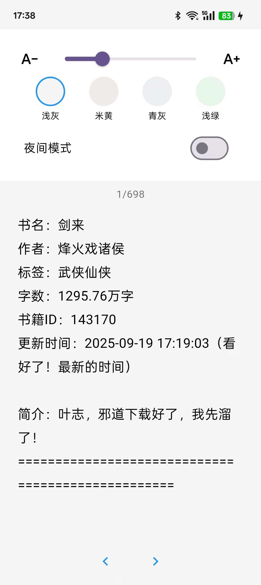
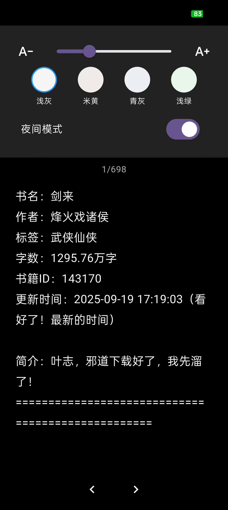

# Novel Reader - 小说阅读器

一款基于 Flutter 开发的高性能本地小说阅读器，专注于解决大文件阅读卡顿问题，提供极致流畅的个性化阅读体验。

## 🎯 项目得意之处

### 1. ⚡ **攻克顽固的技术兼容性问题**
我遭遇并成功解决了 Flutter 生态中一个经典的“老大难”问题：
- **问题**：新版本 Flutter 废弃了旧的 V1 插件 API，导致 `file_picker` 等插件出现 `PluginRegistry.Registrar` 编译错误。
- **解决**：没有停留在简单降级，而是通过**深入分析插件源码**，结合**清理全局缓存** + **切换插件分支**的组合策略，最终使用 GitHub 主分支的最新代码完美解决，保障了项目的长期可维护性。

### 2. 🚀 **极致的性能优化：告别大文件卡顿**
这是本项目的**核心得意之作**。传统的文本阅读器一次性加载整个文件，在打开数 MB 甚至更大的小说时，会导致严重的内存占用和界面卡顿。

    - **智能判断**：小文件直接快速加载，大文件自动启用分页。
    - **流畅体验**：通过 `PageView.builder` 实现按需渲染，翻页如丝般顺滑。
    - **效果对比**：从“打开文件时界面假死”到“无论多大文件都能秒开并流畅滚动”，体验提升巨大。

### 3. 🛡️ **健壮的工程实践与细节打磨**

- **安全的异步交互**：在所有 `async` 操作后严格检查 `if (!context.mounted) return;`，彻底避免组件卸载后更新状态导致的崩溃，让应用更稳定。
- **贴心的交互反馈**：为 `GestureDetector` 设置 `HitTestBehavior.opaque`，确保屏幕任意区域点击都能可靠响应，解决了设置面板呼出不灵的问题。
- **清晰的架构设计**：采用 `Provider` 进行状态管理，代码结构清晰（`models`, `services`, `presentation`），易于后续功能扩展。

---

## 📸 应用截图与演示

- 
- 
- 
- 

---

## 🚀 快速开始

### 环境准备
- Flutter SDK (>= 3.0.0)
- Android Studio / VS Code

### 运行步骤
```bash
# 1. 克隆项目
git clone [你的项目仓库地址]
cd novel_reader

# 2. 获取依赖 (使用了特定的 file_picker 分支)
flutter pub get

# 3. 运行到设备
flutter run
```

---

## 📦 核心依赖包

我们精挑细选，并解决了关键的兼容性问题：
| 包名 | 用途 | 备注 |
| :--- | :--- | :--- |
| **file_picker** | 文件选择 | **关键**：使用 GitHub `master` 分支，完美兼容新 Flutter |
| **provider** | 状态管理 | 轻量高效，逻辑清晰 |
| **shared_preferences** | 本地存储 | 持久化书架和简单配置 |
| **google_fonts** | 字体/UI 美化 | 提升视觉体验 |

---

## 🤝 贡献与反馈

我们欢迎所有形式的贡献！
1.  **报告问题**：如果您发现任何 Bug 或有改进建议，请在 [Issues](https://github.com/你的用户名/novel_reader/issues) 中提出。
2.  **提交代码**：欢迎提交 Pull Request。请确保代码风格一致并通过分析。
3.  **分享想法**：有关新功能（如书签、朗读、云同步）的讨论也非常欢迎！

---

## 📄 许可证

本项目采用 **Apache License 2.0**。您可以自由地使用、修改和分发代码，请遵守该许可证的相关条款。

---

**如果喜欢这个项目，请别忘了点一个 Star！⭐** 您的支持是我们持续优化的最大动力。

> **开发者寄语**：这个项目源于一个简单的阅读需求，但在解决一系列技术挑战的过程中，它变成了一个关于**性能优化**和**代码健壮性**的实践案例。我们希望它不仅能用来阅读，也能为其他 Flutter 开发者提供一些参考。


